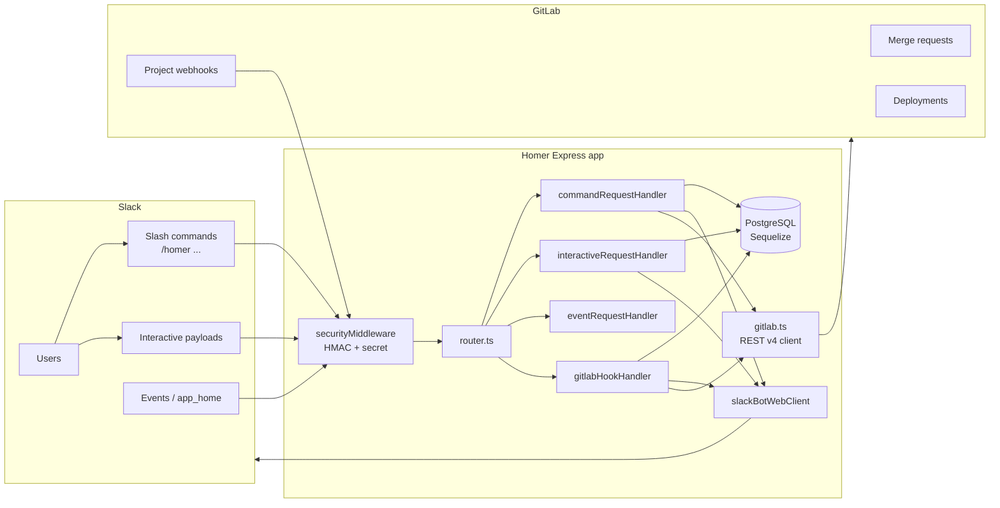
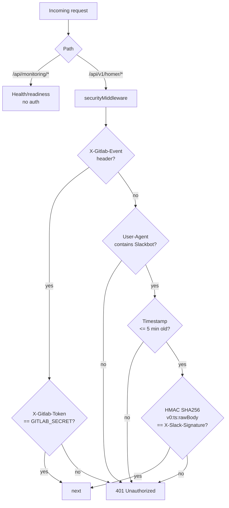
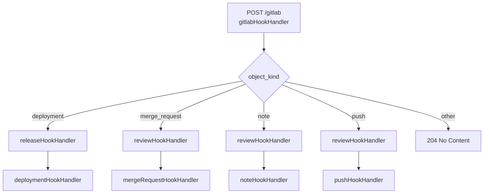
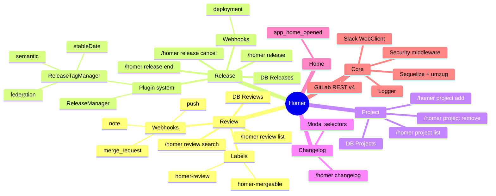
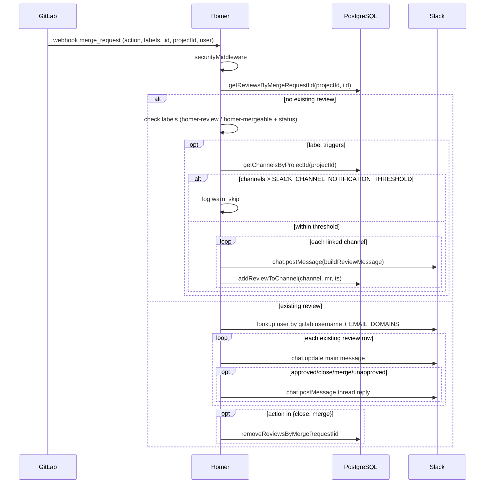
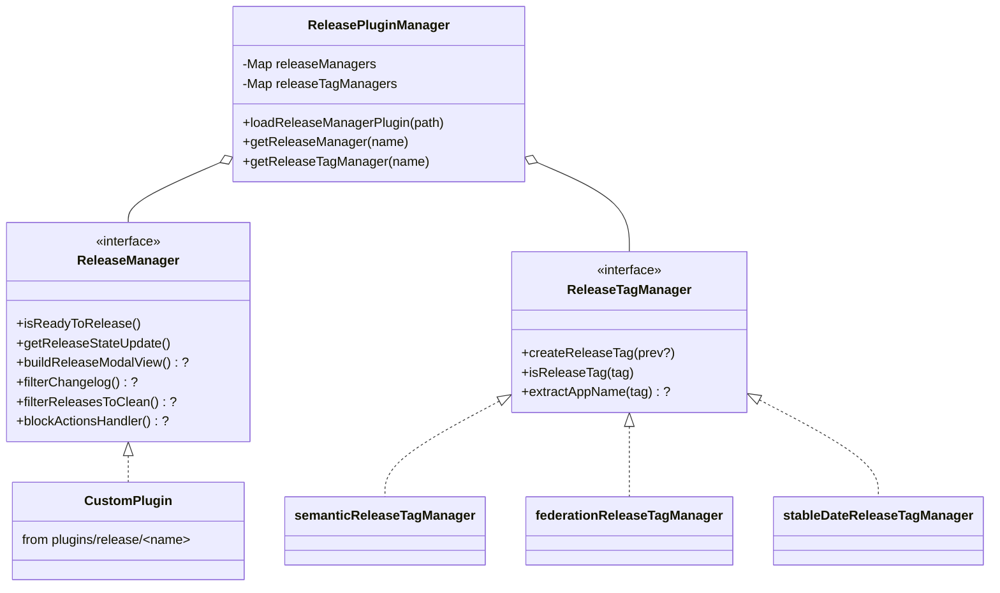
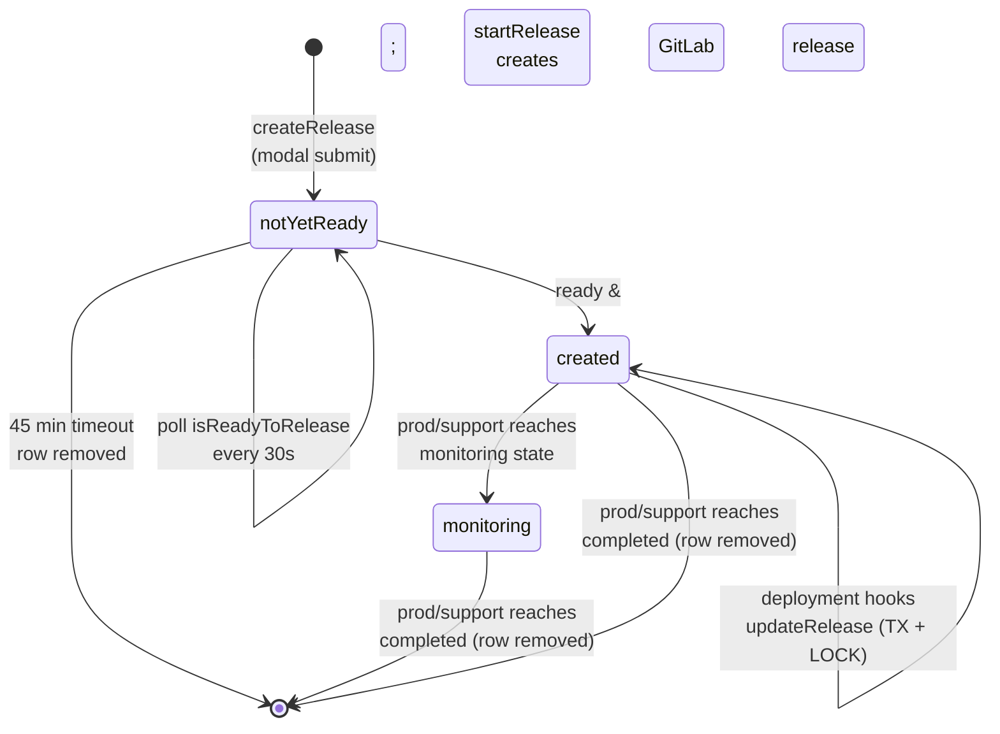
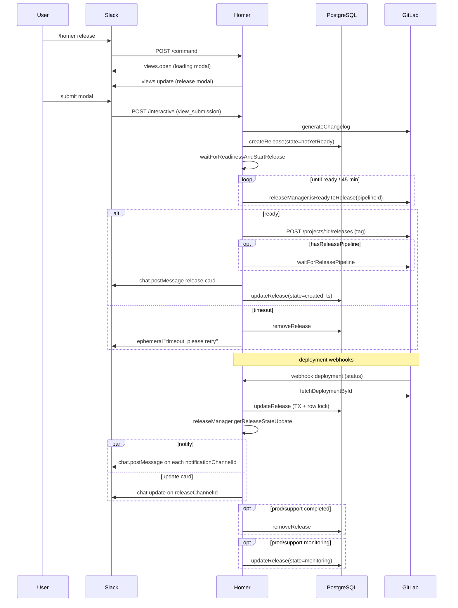
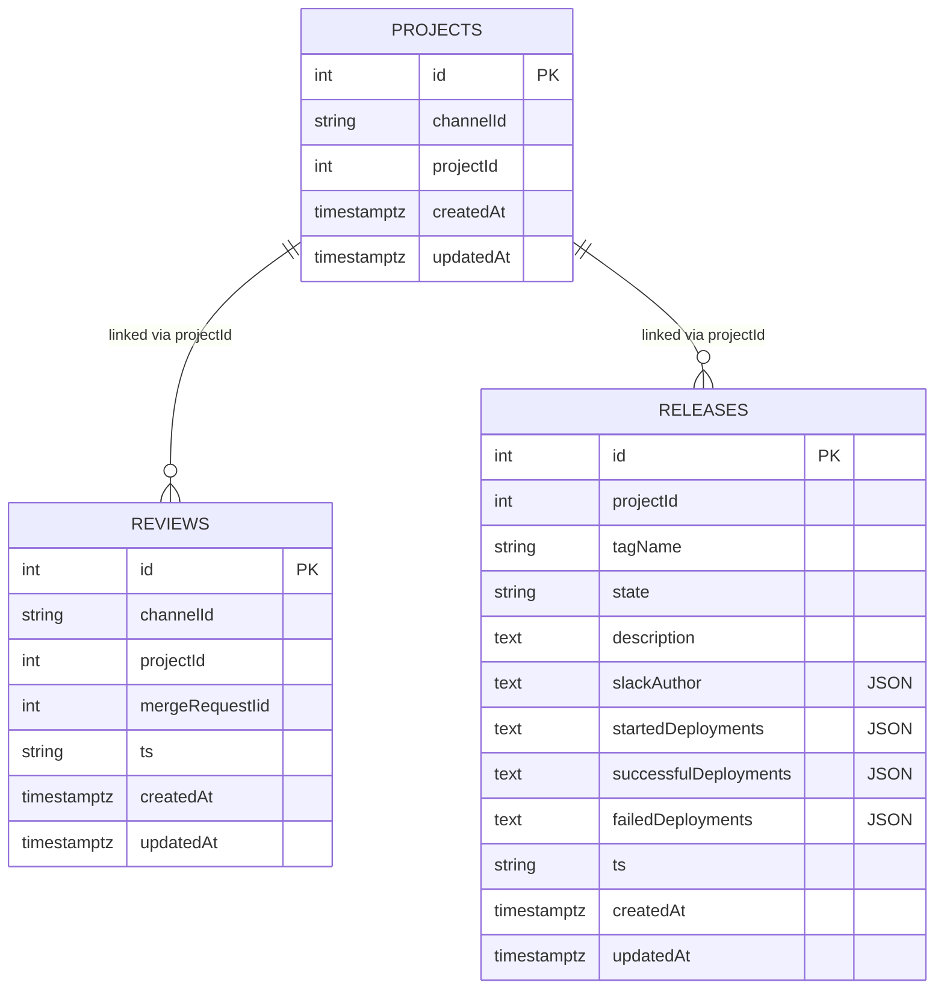
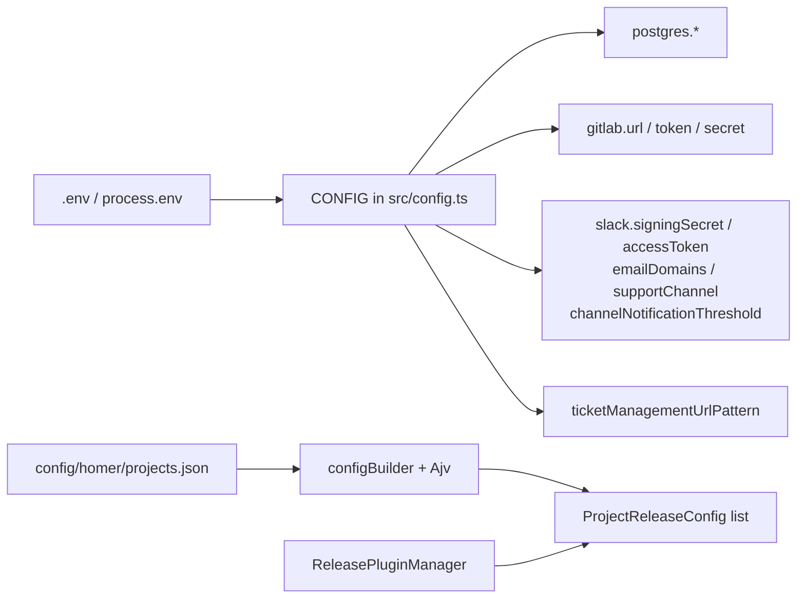

# Homer — Architectural Overview

A Node.js/Express + Sequelize Slack bot that bridges **Slack** ↔ **GitLab** for sharing/tracking merge requests, generating changelogs, and managing project releases.

Entry: `src/index.ts` → `src/start.ts` → `src/app.ts` → `src/router.ts`.

---

## 1. High-level dataflow

- **Slack → Homer**: slash commands (`/homer …`), interactive payloads, events, app-home opens.
- **GitLab → Homer**: project webhooks (`merge_request`, `note`, `push`, `deployment`).
- **Homer → Slack**: `@slack/web-api` `WebClient` (`slackBotWebClient`) posts/updates messages, opens modals, posts ephemerals.
- **Homer → GitLab**: REST v4 calls in `src/core/services/gitlab.ts` using `GITLAB_TOKEN`.

---

## 2. Critical security boundary

`src/core/middlewares/securityMiddleware.ts` — every request to the API router must validate as either GitLab or Slack, otherwise `401`.

> ⚠️ `app.ts:14-16` captures `rawBody` on the request — required for the Slack signature check. Don't refactor body parsing without preserving it.

---

## 3. Routing surface

All under `CONFIG.apiBasePath` (default `/api/v1/homer`):

| Route                             | Handler                     | Purpose                                                               |
| --------------------------------- | --------------------------- | --------------------------------------------------------------------- |
| `POST /command`                   | `commandRequestHandler`     | dispatches `changelog \| project \| release \| review` slash commands |
| `POST /event`                     | `eventRequestHandler`       | Slack events incl. `app_home_opened`                                  |
| `POST /interactive`               | `interactiveRequestHandler` | block actions, view submissions, etc.                                 |
| `POST /gitlab`                    | `gitlabHookHandler`         | dispatched by `object_kind`                                           |
| `POST /release`                   | `helpRequestHandler`        | help passthrough                                                      |
| `POST /review`                    | `helpRequestHandler`        | help passthrough                                                      |
| `GET /api/monitoring/healthcheck` | `healthCheckRequestHandler` | liveness — returns `🍩`                                               |
| `GET /api/monitoring/readiness`   | `readinessRequestHandler`   | DB-backed readiness — `200`/`503`                                     |

---

## 4. Feature mind map

---

## 5. GitLab review flow

`src/review/`

- **Triggers**: `/homer review <search>`, `/homer review list`, or labels `homer-review` / `homer-mergeable` on the MR.
- **Webhook entry**: `mergeRequestHookHandler.ts` — only acts on actions `approved | close | merge | reopen | update | open | unapproved`.

> Guard at `mergeRequestHookHandler.ts:111` — if linked-channels count exceeds `SLACK_CHANNEL_NOTIFICATION_THRESHOLD` (default 3), notifications are skipped to prevent spam.

---

## 6. Release manager

The most stateful part of the system.

### Configuration

`config/homer/projects.json`, validated by Ajv in `src/release/utils/configBuilder.ts`. Each project entry maps to a `ProjectReleaseConfig`:

- `projectId`, `releaseChannelId`, `notificationChannelIds[]`
- `releaseManager` (string → resolved via `ReleasePluginManager`)
- `releaseTagManager` (one of `semantic | federation | stableDate`)
- `hasReleasePipeline?`

### Plugin system

`ReleasePluginManager` is a singleton. Built-in _tag managers_ are registered in the constructor. Custom _release managers_ are dynamically `import()`-ed from `@root/plugins/release/<name>` on first use. Loading rejects the same manager twice.

### State machine

### Lifecycle (sequence)

### Crash recovery

`start.ts:27` calls `waitForNonReadyReleases()` after DB connect → re-runs the readiness loop for every `Release` still in state `notYetReady`. If you rename state values, update this function too.

---

## 7. Database access

`src/core/services/data.ts`

- **PostgreSQL via Sequelize**, connection pool tunable via `POSTGRES_POOL_*`.
- Three models defined inline in `data.ts:34-56`.
- **Migrations**: `NODE_ENV=production` runs `umzug` against `src/core/migrations/*.js` (`migrator.ts`). Non-prod uses `sequelize.sync({ alter: true })` for convenience. The single existing migration (`2026.04.02T00.00.00.initial-schema.ts`) is intentionally idempotent (`CREATE TABLE IF NOT EXISTS`) so DBs that were previously sync-managed don't break. CLI: `pnpm migrate{,:down,:status}` via `src/migrate.ts`.
- **Cleanup**: on startup and every 24 h, rows whose `updatedAt` is older than 15 days are deleted (`cleanOldEntries`).
- **Concurrency**: `updateRelease` wraps the read-modify-write in a transaction with `LOCK.UPDATE` to avoid races between concurrent deployment hooks (`data.ts:276`).
- **Quirk**: deployment lists are stored as **stringified JSON in TEXT columns**. `getReleaseDeployments` (`data.ts:336`) transparently migrates the legacy `["staging","production"]` shape to `[{environment, date}]` on read.
- **Readiness probe** (`/api/monitoring/readiness`) calls `checkDatabaseConnection()` (`sequelize.authenticate()`), so it reflects DB health.

---

## 8. Configuration & environment

Auth/secrets:

- `GITLAB_SECRET`, `GITLAB_TOKEN`, `SLACK_SIGNING_SECRET`, `SLACK_BOT_USER_O_AUTH_ACCESS_TOKEN`

Mapping/config:

- `EMAIL_DOMAINS` — used to derive Slack user from GitLab username
- `GITLAB_URL`, `TICKET_MANAGEMENT_URL_PATTERN`
- `SLACK_SUPPORT_CHANNEL_{ID,NAME}`
- `SLACK_CHANNEL_NOTIFICATION_THRESHOLD` (default 3)

DB: `POSTGRES_HOST/USER/PASSWORD/PORT/DATABASE_NAME/POOL_*`.

---

## 9. Critical points

- The **security middleware** is the only thing protecting the bot. Anything mounted under `CONFIG.apiBasePath` must trust those headers. Health endpoints are deliberately above it.
- **`rawBody` capture in `app.ts`** is required for Slack signature verification — preserve it across body-parser refactors.
- **`SLACK_CHANNEL_NOTIFICATION_THRESHOLD`** silently drops MR notifications above the limit; tune per project noise.
- **GitLab `Maintainer` role** is required on the token, otherwise releases/tag operations fail.
- **Release race conditions** are guarded by Sequelize transactions + row-level locks; any change to release state must go through `updateRelease`.
- **Plugin loading is one-shot** — `ReleasePluginManager.loadReleaseManagerPlugin` rejects re-loading the same manager.
- **Crash-resilient releases** rely on `Release.state === 'notYetReady'`; renaming this value breaks `waitForNonReadyReleases`.
- **Production migrations**: only files matching `src/core/migrations/*.js` (compiled output) are picked up by umzug — make sure migrations are built before `pnpm migrate`.
